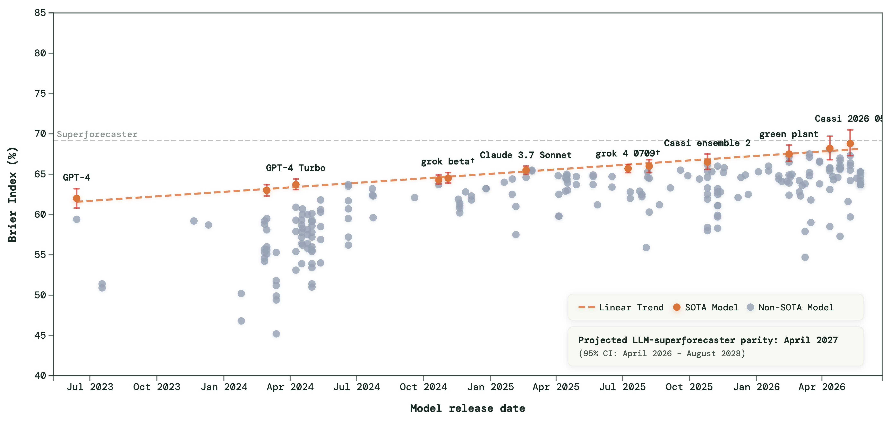

# An honest scoreboard for market forecasting

**Ethan Jackson, Ali Kore, Behnoosh Zamanlooy & Shayaan Mehdi**

*Part 1 of 2.*

## From public leaderboards to a single series

[ForecastBench](https://forecastbench.org/explore) keeps a public scoreboard of
how well AI systems predict real future events. Over successive rounds, the best
LLM forecasters have been climbing toward the line drawn by human
superforecasters. If you build with these models, that trend raises a concrete
question: does the skill transfer to a specific series — a market index, a
demand curve, a risk metric — where being roughly right on average isn't enough
and you need a full distribution?

That is the question this series tries to answer. It is also
the reason forecasting has become such an unusually honest benchmark for AI in
the first place — the future cannot be memorized. A model can regurgitate a
benchmark it saw in training, but it cannot have seen next week's close. Score a
forecast against what actually happened and you get a number no amount of
pretraining can fake.

***Figure 1.** The trend that motivates this series: each point is a model scored
on ForecastBench's live questions about unresolved future events; the frontier
has climbed steadily toward the human-superforecaster reference line. Figure from
[ForecastBench](https://www.forecastbench.org/explore/) by the
[Forecasting Research Institute](https://forecastingresearch.org/), captured
21 July 2026 and reproduced unmodified under
[CC BY-SA 4.0](https://creativecommons.org/licenses/by-sa/4.0/).*

This two-part series accompanies Vector's Agentic Forecasting Bootcamp; the full
code, data pipeline, and evaluation harness are open at
[github.com/VectorInstitute/agentic-forecasting](https://github.com/VectorInstitute/agentic-forecasting),
and the work in this series lives in a
[fork of it](https://github.com/VectorInstitute/agentic-forecasting-live). In Part 1 we
build the scoreboard for one concrete series and run the fixed-context methods —
from a naive baseline to gradient-boosted trees to a frozen LLM — up to their
ceiling. Part 2 brings in agents that read.

## The problem: a probabilistic forecast of the TSX

Our series is the S&P/TSX Composite, the main Canadian equity index. We forecast
it because we're in Toronto and it's the market on our doorstep — but it is also
a genuinely useful stress test. The TSX is heavy in energy and materials, so it
reacts fast to the wider world: an oil move, a tariff announcement, a war-risk
premium all show up in it quickly.

We also chose it because it is hard. Market questions are among the most
difficult on any forecasting benchmark — ForecastBench reports progress on market
questions separately from dataset questions for exactly that reason — and a
heavily traded index is close to the worst case for a news-reading agent, because
thousands of participants are already pricing the same headlines into the close
before the agent finishes reading them. Picking the TSX is not handing agentic
methods an easy win. It is the opposite, deliberately.

We forecast log returns, not price levels. Levels drift and trend, and a model
can look impressive on levels just by predicting "about the same as yesterday."
Returns strip that away and force the forecaster to say something about what
changes. We predict the cumulative log return at three horizons — 1, 5, and 21
business days: roughly tomorrow, next week, next month.

And we forecast probabilistically. A single-number point forecast of tomorrow's
return is almost useless: it will be wrong, and it tells you nothing about *how*
wrong it might be. What a decision-maker needs is a distribution: a best guess
*and* an honest width. So every method here emits a full grid of quantiles.

***Figure 2.** The level path we forecast, with four landmark windows that recur
through this series: the 2025 tariff drawdown (−12.8% peak-to-trough) and its
+19.3% rebound, and the 2026 war-driven drawdown (−9.3%) and +8.5% recovery. We
forecast the close-to-close log return of this series, not the level; the level
is shown only so the events are legible.*

## The referee: one score for every method

Before any method makes a claim, we need a referee — one score that ranks a
distribution against a single realized outcome, and ranks every method the same
way.

That score is the Continuous Ranked Probability Score, or CRPS. Intuitively: a
probabilistic forecast spreads probability mass across the number line; the
outcome lands at one point, and CRPS measures how far the forecast's mass sat,
on average, from where reality landed. It rewards two things at once — being
*sharp* (a narrow, confident distribution) and being
*calibrated* (that mass actually sitting where the outcome falls). A tight
forecast in the wrong place is punished hard; a vague, hedge-everything forecast
is punished gently but never wins. Lower is better, and conveniently, CRPS
collapses to plain absolute error when the forecast is a single point — so
probabilistic and point forecasts sit on one scale.

***Figure 3.** The trade-off made concrete, in a synthetic example at daily
log-return scale. Two Gaussian forecasts share a median of 0%, facing a realized
move of +0.4%. The sharp forecast (σ = 0.4%) scores CRPS 0.0024; the wide one
(σ = 1.2%) scores 0.0033. Sharpness wins — but only because the sharp forecast
also placed its mass near what happened. Had the outcome been a 3% crash, the
sharp forecast is the one that gets punished.*

With a referee in hand, the evaluation skeleton is one sentence, repeated for
every method: define the task (log return at horizon *h*), fix an origin date
and the information cutoff at that date, have the predictor emit its quantiles,
wait for the outcome to resolve, and score it with CRPS. Same question, same
cutoff, same score — every method on the same page.

## The cutoff, honestly

We score each method not once but over many origins — a rolling-origin
evaluation. Slide the origin date forward through history, re-forecast at each,
and average the CRPS. That turns a single lucky or unlucky call into a
distribution of skill.

We run two such sweeps. The first is a **2025 backtest**: weekly origins across
2025, roughly 50 resolved forecasts per horizon. The second is a **protected
2026 evaluation**: weekly origins in the first half of 2026, around 24 per
horizon, over data more recent than most of what these methods could have been
built or tuned against.

The distinction matters most for the LLMs, and here we are deliberately
skeptical. We do not trust stated training cutoffs. A model asked to forecast an
"unknown" 2025 date may quietly know how that quarter turned out, so its
backtest score is optimistic at best. The protected 2026 window is our honest
read — recent enough that leakage is less likely, though never zero. So we
report both sweeps side by side, and when a method's backtest lead evaporates in
the protected window, we say so.

## The fixed-context ladder

Every method on this ladder works from a fixed information window: the series
itself, for some a panel of numeric covariates, and — for the LLM rung — a
short text description of the task. None of them can go looking for more. That
constraint is the whole point of Part 1: establish what pre-assembled context
can do, and how far. Part 2 lifts it.

The bottom rung is the **naive floor**: take the recent distribution of returns
and carry it forward. It is the "your model isn't magic" baseline, and it is no
pushover — but everything worth keeping should beat it by a clear margin. At h=1
in the protected window it scores CRPS 0.0093, and the best method roughly
halves that.

Next, the **classical statistical methods** — ETS, a Kalman-filter local model,
and AutoARIMA. These are decades-refined, fully interpretable, and near-free to run:
they fit a few parameters to the series' own autocorrelation and emit a
calibrated distribution. On the TSX they clear the naive floor comfortably and,
at the short horizon, land within a hair of far heavier machinery.

Then **LightGBM** — gradient-boosted trees — with and without a covariate panel:
a Canadian macro-financial set spanning the Bank of Canada policy rate, StatCan
CPI and unemployment, WTI oil, gold, USD/CAD, the VIX, and the S&P 500.

The top rung swaps the purpose-built models for a general-purpose LLM. The
technique, the **LLM Process** (LLMP), was developed by a team of researchers
that includes Vector faculty member David Duvenaud. You serialize the return
history, optionally the covariate panel, and a short description of the series
into a text prompt, then ask the model to emit the full quantile grid directly,
as numbers. No fine-tuning, no forecasting head, no tools. We score those
quantiles with CRPS exactly like every other method: same origins, same cutoff,
same referee.

One distinction matters more than it looks, and Part 2 turns on it. An LLMP is
not strictly numbers-only — it reads the series description we give it, and the
technique can condition on any text supplied at inference time, reports
included. What it cannot do is gather that context itself: everything it sees
is assembled in advance, in code. The methods allowed to go out and look — or to
study on their own — are the agents, and because that agency is the hypothesis
this series was built to test, they get Part 2 to themselves.

***Figure 4.** The scoreboard: mean CRPS ×10⁻³ by method and horizon, the 2025
backtest beside the protected 2026 eval, cells shaded by within-column rank
(darker is better) and rows ordered by backtest rank — so the eval columns
visibly reshuffle the backtest order. Every cell is recomputed from the
persisted prediction store and reproduces the released leaderboards exactly.*

In the 2025 backtest, plain LightGBM tops the h=1 column at CRPS 0.0038. In the
protected 2026 window that lead does not survive: LightGBM-with-covariates takes
h=1 at 0.00497, the `gemini-3.1-flash-lite` LLMP is essentially tied at 0.00501 —
indistinguishable — and plain LightGBM slips to the middle of the pack. This is
exactly what the cutoff section warned about: a backtest ranking is a hypothesis,
and the protected window is where it gets tested. At h=5 and h=21 the ordering
reshuffles again — no single family owns every horizon — while the classical
methods stay competitive at the short end and the covariate panel earns its keep
unevenly, helping at some horizons and adding noise at others.

The LLMP row is the one worth pausing on, because it works at all. A frozen,
general-purpose model, handed a column of numbers and a little context about
them, emits a genuine predictive distribution — calibrated well enough to tie
purpose-built gradient-boosted trees at the short horizon, for a fraction of a
cent in the case of Gemini Flash-Lite. Across the model matrix — several frontier and lightweight models, with and
without covariates — the LLMP forecasts land throughout the leaderboard,
sometimes leading a horizon, sometimes mid-pack, never obviously broken. At the
longer backtest horizons a heavier reasoning model (Claude Sonnet 5) tops h=5 and h=21, though its per-forecast cost is an order of magnitude
above a Gemini Flash-Lite call — a trade-off worth naming out loud.

But the ranking is only half the story.

***Figure 5.** Per-origin CRPS day by day across the full 2025–26 stretch, at
all three horizons, with the landmark windows shaded (red drawdowns, green
rebounds — identities as in Figure 2). All five methods resolve across the full
daily grid, roughly 365 origins per horizon.*

Every method's error spikes at the same moments — the 2025 tariff crash lifts all
three horizons at once, the 2026 war window lifts them again — because the cause
of each break is exogenous to the series. No amount of tree depth or covariate
engineering sees a tariff coming from the price history alone.

It is fair to ask whether a richer panel would. Ours is not futures-free: the oil
and gold legs are front-month futures contracts, and the VIX is an
options-implied measure, so forward-looking prices are already in the mix. What
the panel does not carry is term structure — the shape of the forward curve, or
index-level futures and options on the TSX itself — and that is a reasonable
extension we would take next. But it is a difference of degree. A forward curve
prices what the market already expects; it does not tell you a tariff is coming
tomorrow.

***Figure 6.** The ceiling, driven home. Through the 2025 drawdown-and-rebound
the market swung between −4.8% and +5.3% in a single day, while the forecast
medians never left the −0.83% to +1.37% band. That gap is not timidity; it is a
correct probabilistic forecaster recognizing that the daily move is close to
unforecastable and hedging toward zero. The market is loud; a good forecast is
quiet.*

## The rung that has to read

Step back and the ladder tells one story. From the naive floor to
gradient-boosted trees to a frozen frontier LLM, every rung improves the shape
of the distribution — sharper here, better-calibrated there — and every rung
shares the identical failure mode. Look again at Figure 5: the error spikes line
up across all of them, at exactly the tariff and war windows, because the cause
of each regime break was not in the price history at those origins. It was in
the news. A tariff is announced in words before it is a number in a series; a
war-risk premium is a headline before it is a return.

That appears to be the ceiling, on this series, for forecasters that cannot
seek context. We
would not claim it is a hard limit: a more context-sensitive numerical model is
certainly buildable — richer futures and term-structure signals are the obvious
place to start — but such models are difficult to build well for general classes
of problems, which is much of why the off-the-shelf result above is interesting.
A cheap, frozen LLM, handed nothing but numbers and a little framing, drew level
with a tuned gradient-boosting model. That is a genuinely useful thing to know,
and it is what makes the next question worth asking: if a general model does this
well reading numbers we chose for it, what happens when it can go and find the
context itself? In Part 2 we give the forecaster the news — and then face the
harder problem of how you trust one that does.

---

**Reference**

Requeima, J., Bronskill, J., Choi, D., Turner, R. E., & Duvenaud, D. (2024).
[LLM Processes: Numerical Predictive Distributions Conditioned on Natural
Language](https://arxiv.org/abs/2405.12856). *Advances in Neural Information
Processing Systems, 37*, 109609–109671.
